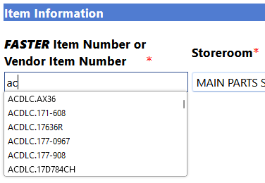
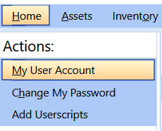
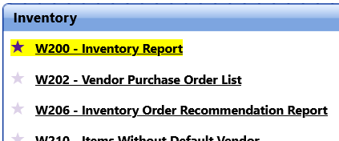
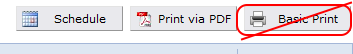

# City of Sault Ste. Marie Userscripts

Web browser userscripts to help with common irks in our third party applications.

Scripts are tested in the [Violentmonkey browser extension](https://violentmonkey.github.io/),
available for Chrome, Firefox, Edge, and others.

They will likely work with other userscript extensions, like Greasemonkey, Tampermonkey, and Firemonkey.

❗ **Always remember! Only install Userscripts you completely trust!**

## Userscripts for FASTER Web

[FASTER Web](https://fasterasset.com/products/fleet-management-software/) is a cloud-based, fleet management information system (FMIS).
It can be used to track assets, maintenance on those assets, and parts inventory used by those assets.

### All Sections

#### 📜 [Exact Match Default](https://github.com/cityssm/userscripts/raw/main/fasterWeb/exactMatch.user.js)

- Remembers the last used "Exact Match" checkbox setting by domain in the menu search.

#### 📜 [Advanced Search Results](https://github.com/cityssm/userscripts/raw/main/fasterWeb/advancedSearchResults.user.js)

- Loads search results immediately on Advanced Search and other search pages.

#### 📜 [Domain Tabs](https://github.com/cityssm/userscripts/raw/main/fasterWeb/domainLinks.user.js)

- Updates domain tabs to default to Advanced Search pages.

#### 📜 [Focus Outlines](https://github.com/cityssm/userscripts/raw/main/fasterWeb/focusOutlines.user.js)

- Increases accessibility by outlining actionable elements on hover and keyboard focus.

#### 📜 [Horizontal Menu Separators](https://github.com/cityssm/userscripts/raw/main/fasterWeb/horizontalMenuSeparator.user.js)

- Replaces the thick block separator with a thin black line.

#### 📜 [Print Friendly](https://github.com/cityssm/userscripts/raw/main/fasterWeb/printFriendly.user.js)

- Improves print-friendliness by only printing the content area.

#### 📜 [Increase Font Sizes](https://github.com/cityssm/userscripts/raw/main/fasterWeb/biggerText.user.js) 🐞

- Set the zoom level to 130%, making the text more readable.

### Autocompletes

#### 📜 [Asset Number Autocomplete](https://github.com/cityssm/userscripts/raw/main/fasterWeb/assetNumberAutocomplete.user.js)

- Adds autocomplete suggestions to **asset number** input fields.
- Define "assetNumbers.json" URL in options.
- See a [sample "assetNumbers.json"](./fasterWeb/data/assetNumbers.json) file for help structuring your own,
  or use the [FASTER Web Helper service](https://github.com/cityssm/faster-web-helper) to generate it for you
  from a scheduled report.

#### 📜 [Item Number Autocomplete](https://github.com/cityssm/userscripts/raw/main/fasterWeb/itemNumberAutocomplete.user.js)

- Adds autocomplete suggestions to **item number** input fields.
- Define "itemNumbers.json" URL in options.
- See a [sample "itemNumbers.json"](./fasterWeb/data/itemNumbers.json) file for help structuring your own,
  or use the [FASTER Web Helper service](https://github.com/cityssm/faster-web-helper) to generate it for you
  from a scheduled report.

### Sault Ste. Marie Specific

#### 📜 [Field Validation](https://github.com/cityssm/userscripts/raw/main/fasterWeb/ssmFieldValidation.user.js)

- Enforces field validation as per Sault Ste. Marie's requirements.

### Home

#### 📜 [Home - Link to Userscripts](https://github.com/cityssm/userscripts/raw/main/fasterWeb/homeLinkToUserscripts.user.js)

- Adds a link to the City's Userscripts page to the Actions menu.

### Maintenance

#### 📜 [Maintenance - Work Order / Direct Charge Header Height](https://github.com/cityssm/userscripts/raw/main/fasterWeb/workOrderHeaderHeight.user.js)

- Stops the header from changing sizes between work order and direct charge tabs.

### Reports

#### 📜 [Reports - Highlight Favourites](https://github.com/cityssm/userscripts/raw/main/fasterWeb/reportFavourites.user.js)

- Makes favourite reports easier to find.

#### 📜 [Reports - Remove "Basic Print"](https://github.com/cityssm/userscripts/raw/main/fasterWeb/reportHideBasicPrint.user.js) 

- Removes the unsupported "Basic Print" button.

## Userscripts for Spiceworks

[Spiceworks](https://www.spiceworks.com/free-cloud-help-desk-software/) is a cloud based IT helpdesk application.

### All Sections

#### 📜 [IT Tools Menu Links](https://github.com/cityssm/userscripts/raw/main/spiceworks/itTools.user.js)

- Replaces the "IT Tools" marketing links with links to the actual tools.

### Help Desk / Tickets

#### 📜 [Tickets - Fade Ticket List](https://github.com/cityssm/userscripts/raw/main/spiceworks/ticketsFade.user.js)

- Reduces the visiblity of the ticket list when viewing a ticket.

#### 📜 [Help Desk - Remove Unused Sidebar Tools](https://github.com/cityssm/userscripts/raw/main/spiceworks/helpdeskSidebar.user.js)

- Adds menu options to remove unused tools from the help desk sidebar.

### Help Desk / Knowledge Base

#### 📜 [Knowledge Base - Remove "New Article" Button for Managers](https://github.com/cityssm/userscripts/raw/main/spiceworks/knowledgeBaseAdd.user.js)

- Removes the "New Article" button for manager users, since it's not supported anyways.
