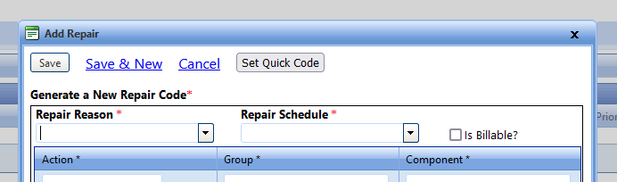

# City of Sault Ste. Marie Userscripts

Web browser userscripts to help with common irks in our third party applications.

Scripts are tested in the [Violentmonkey browser extension](https://violentmonkey.github.io/),
available for Chrome, Firefox, Edge, and others.

They will likely work with other userscript extensions, like Greasemonkey, Tampermonkey, and Firemonkey.

❗ **Always remember! Only install Userscripts you completely trust!**

## Userscript Categories

| Icon | Category                                                  |
| ---- | --------------------------------------------------------- |
| ⭐   | Recommended                                               |
| 🐇   | Increases speed or efficiency                             |
| 🧑‍🦽‍➡️   | Increases accessibility                                   |
| 📱   | Increases usability on mobile devices and smaller screens |
| 💋   | Makes things prettier                                     |
| 🐉   | Under development or buggy (_Thar be dragons!_)           |

---

## Userscripts for FASTER Web

[FASTER Web](https://fasterasset.com/products/fleet-management-software/) is a cloud-based, fleet management information system (FMIS).
It can be used to track assets, maintenance on those assets, and parts inventory used by those assets.

- [All Sections](#all-sections-of-faster-web)
- [User Experience](#user-experience-changes-and-improvements-for-faster-web)
- [Autocomplete Helpers](#autocomplete-helpers-for-faster-web)
- [Domain Specific](#faster-web-domain-specific)
- [Sault Ste. Marie Specific](#sault-ste-marie-specific-userscripts-for-faster-web)

**Overwhelmed?**
See [Suggested FASTER Web Userscripts by User Role](./fasterWeb/userSetup.md)
for a list of recommended scripts.

### All Sections of FASTER Web

| Script                                                                                                                                                                                                          | Categories |
| --------------------------------------------------------------------------------------------------------------------------------------------------------------------------------------------------------------- | ---------- |
| [Advanced Search Action Links](https://github.com/cityssm/userscripts/raw/main/fasterWeb/advancedSearchActions.user.js)  Includes easier-to-click links to the advanced search pages in the Actions menus. | 📱         |
| [Advanced Search Results](https://github.com/cityssm/userscripts/raw/main/fasterWeb/advancedSearchResults.user.js)  Loads search results immediately on Advanced Search and other search pages.            | 🐇         |
| [Domain Tabs](https://github.com/cityssm/userscripts/raw/main/fasterWeb/domainLinks.user.js)  Updates domain tabs to default to Advanced Search pages.                                                     |            |
| [Exact Match Default](https://github.com/cityssm/userscripts/raw/main/fasterWeb/exactMatch.user.js)  Remembers the last used "Exact Match" checkbox setting by domain in the menu search.                  | 🐇         |
| [Other Field Default](https://github.com/cityssm/userscripts/raw/main/fasterWeb/searchDefaultOtherField.user.js)  Remembers the last used "Other" field in search filters.                                 | 🐇         |
| [Print Friendly](https://github.com/cityssm/userscripts/raw/main/fasterWeb/printFriendly.user.js)  Improves print-friendliness by only printing the content area.                                          | 💋         |

### User Experience Changes and Improvements for FASTER Web

| Script                                                                                                                                                                                                                               | Categories  |
| ------------------------------------------------------------------------------------------------------------------------------------------------------------------------------------------------------------------------------------ | ----------- |
| [Bigger Click Targets](https://github.com/cityssm/userscripts/raw/main/fasterWeb/biggerClickTargets.user.js)  Increases the size of some click targets, increasing usability on smaller screens.                                | ⭐ 🧑‍🦽‍➡️ 📱 💋 |
| [Drag Disable](https://github.com/cityssm/userscripts/raw/main/fasterWeb/dragDisable.user.js)  Disables certain drag-and-drop features, like rearranging windows, to improve usability on touchscreens.                         | 📱          |
| [Focus Outlines](https://github.com/cityssm/userscripts/raw/main/fasterWeb/focusOutlines.user.js)  Increases accessibility by outlining actionable elements on hover and keyboard focus.                                        | 🧑‍🦽‍➡️          |
| [Horizontal Menu Separators](https://github.com/cityssm/userscripts/raw/main/fasterWeb/horizontalMenuSeparator.user.js)  Replaces the thick block separator with a thin black line.                                             | 💋          |
| [Image Button Fix](https://github.com/cityssm/userscripts/raw/main/fasterWeb/imageButtonFix.user.js)  Moves images that appear to be part of buttons into the button elements to make the images clickable.                     | 💋          |
| [Increase Font Sizes](https://github.com/cityssm/userscripts/raw/main/fasterWeb/biggerText.user.js)  Set the zoom level to 130%, making the text more readable. (Can cause issues with modal placement.)                        | 🐉          |
| [Remove Tab Index](https://github.com/cityssm/userscripts/raw/main/fasterWeb/tabIndexRemove.user.js)  Removes overridden tab-key ordering, which makes it difficult to track the cursor when using the keyboard for navigation. | 🧑‍🦽‍➡️          |
| [Set Viewport](https://github.com/cityssm/userscripts/raw/main/fasterWeb/setViewport.user.js)  Sets the viewport to fix broken controls on smaller screens.                                                                     | ⭐ 📱       |

### Autocomplete Helpers for FASTER Web

[Asset Number Autocomplete](https://github.com/cityssm/userscripts/raw/main/fasterWeb/assetNumberAutocomplete.user.js)

- Adds autocomplete suggestions to **asset number** input fields.
- Define "assetNumbers.json" URL in options.
- See a [sample "assetNumbers.json"](./fasterWeb/data/assetNumbers.json) file for help structuring your own,
  or use the [FASTER Web Helper service](https://github.com/cityssm/faster-web-helper) to generate it for you
  from a scheduled report.

[Item Number Autocomplete](https://github.com/cityssm/userscripts/raw/main/fasterWeb/itemNumberAutocomplete.user.js)

- Adds autocomplete suggestions to **item number** input fields.
- Define "itemNumbers.json" URL in options.
- See a [sample "itemNumbers.json"](./fasterWeb/data/itemNumbers.json) file for help structuring your own,
  or use the [FASTER Web Helper service](https://github.com/cityssm/faster-web-helper) to generate it for you
  from a scheduled report.

### FASTER Web Domain Specific

| Domain      | Script                                                                                                                                                                                                                                                                              | Categories |
| ----------- | ----------------------------------------------------------------------------------------------------------------------------------------------------------------------------------------------------------------------------------------------------------------------------------- | ---------- |
| Home        | [Home - Link to Userscripts](https://github.com/cityssm/userscripts/raw/main/fasterWeb/homeLinkToUserscripts.user.js)  Adds a link to the City's Userscripts page to the Actions menu.             | 💋         |
| Assets      | [Create Asset Width Fix](https://github.com/cityssm/userscripts/raw/main/fasterWeb/createAssetWidthFix.user.js)  Reduces width of the "Create Incoming Asset from Template" button to fix the form on touchscreens.                                                            | 📱         |
| Maintenance | [Maintenance - Hide "Alert Mapping & Filtering" Action](https://github.com/cityssm/userscripts/raw/main/fasterWeb/alertMappingHide.user.js)  For users that don't have the "Alerts Mapping Add-on", the link is unnecessary.                                                   | 💋         |
| Maintenance | [Maintenance - Work Order / Direct Charge Default Parts Tab](https://github.com/cityssm/userscripts/raw/main/fasterWeb/workOrderDefaultPartsTab.user.js)  Changes the default tab to "Parts" when opening a work order or direct charge, helping storeroom staff save a click. | 🐇         |
| Maintenance | [Maintenance - Work Order / Direct Charge Header Height](https://github.com/cityssm/userscripts/raw/main/fasterWeb/workOrderHeaderHeight.user.js)  Stops the header from changing sizes between work order and direct charge tabs.                                             | ⭐ 💋      |
| Maintenance | [Maintenance - Quick Repair Codes](https://github.com/cityssm/userscripts/raw/main/fasterWeb/quickRepairCodes.user.js)  Simplifies adding commonly used repair codes to direct charges.                         | 🐉         |
| Reports     | [Reports - Highlight Favourites](https://github.com/cityssm/userscripts/raw/main/fasterWeb/reportFavourites.user.js)  Makes favourite reports easier to find.                                               | 🐇 💋      |
| Reports     | [Reports - Remove "Basic Print"](https://github.com/cityssm/userscripts/raw/main/fasterWeb/reportHideBasicPrint.user.js)  Removes the unsupported "Basic Print" button.                       | ⭐ 🐇 💋   |

### Sault Ste. Marie Specific Userscripts for FASTER Web

Probably not much value outside of Sault Ste. Marie.

| Script                                                                                                                                                                           | Categories |
| -------------------------------------------------------------------------------------------------------------------------------------------------------------------------------- | ---------- |
| [Field Validation](https://github.com/cityssm/userscripts/raw/main/fasterWeb/ssmFieldValidation.user.js)  Enforces field validation as per Sault Ste. Marie's requirements. | 🐇         |

---

## Userscripts for Spiceworks

[Spiceworks](https://www.spiceworks.com/free-cloud-help-desk-software/) is a cloud based IT helpdesk application.

### All Sections

#### 📜 [IT Tools Menu Links](https://github.com/cityssm/userscripts/raw/main/spiceworks/itTools.user.js)

- Replaces the "IT Tools" marketing links with links to the actual tools.

### Help Desk / Tickets

#### 📜 [Tickets - Fade Ticket List](https://github.com/cityssm/userscripts/raw/main/spiceworks/ticketsFade.user.js)

- Reduces the visiblity of the ticket list when viewing a ticket.

#### 📜 [Help Desk - Remove Unused Sidebar Tools](https://github.com/cityssm/userscripts/raw/main/spiceworks/helpdeskSidebar.user.js)

- Adds menu options to remove unused tools from the help desk sidebar.

### Help Desk / Knowledge Base

#### 📜 [Knowledge Base - Remove "New Article" Button for Managers](https://github.com/cityssm/userscripts/raw/main/spiceworks/knowledgeBaseAdd.user.js)

- Removes the "New Article" button for manager users, since it's not supported anyways.
